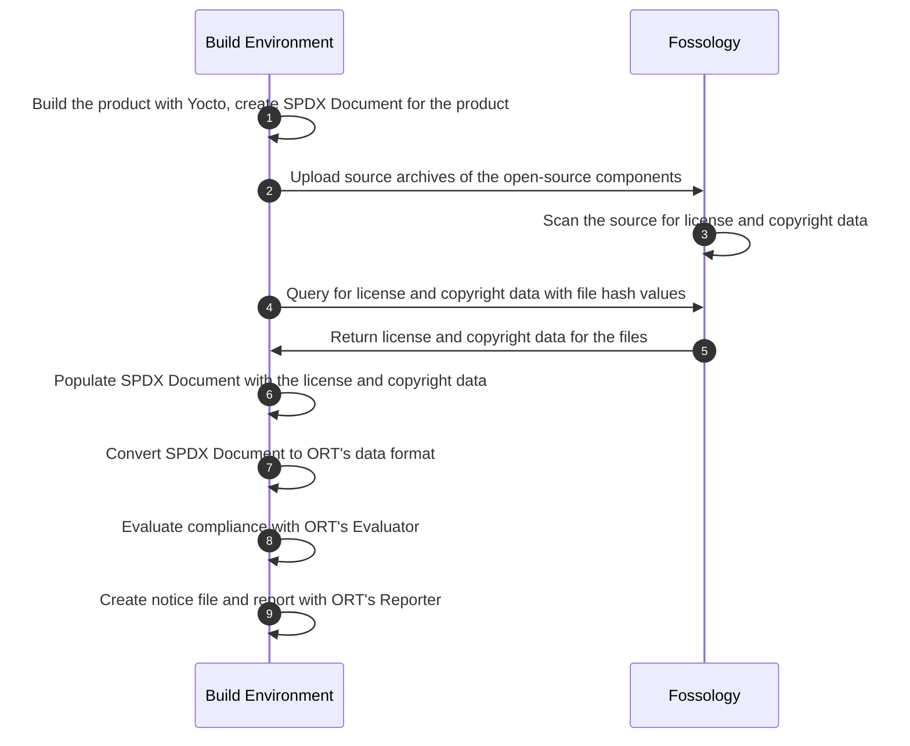

# Introduction

Double Open aims to automate open source compliance for the
[Yocto Project](https://www.yoctoproject.org/).

## Overview

Below is a high-level overview of the compliance workflow:

