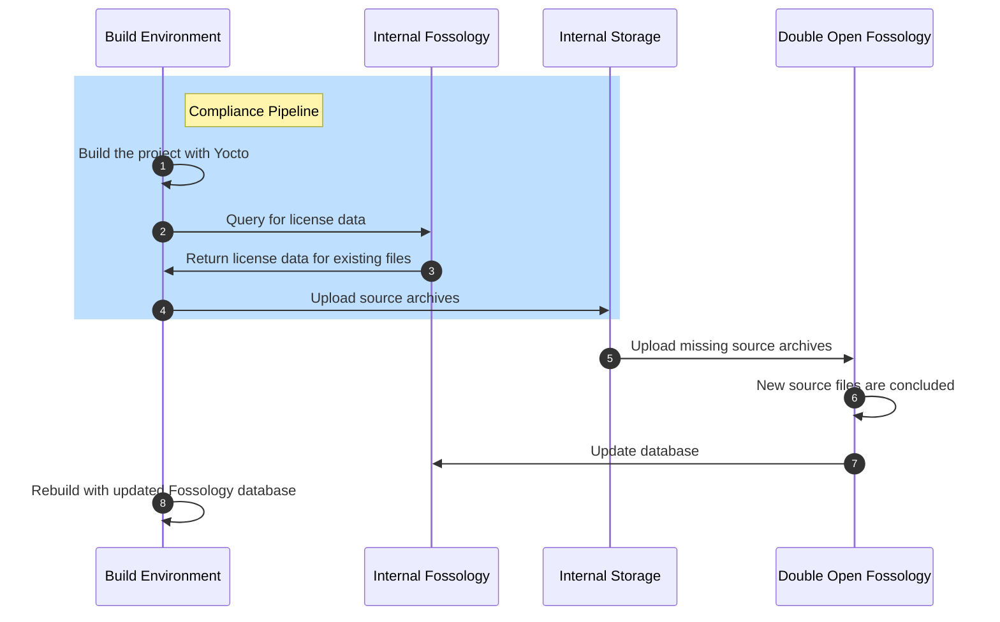

# Migrate Fossology database

The Fossology database can be migrated from an instance to another. This can be useful if the
pipeline needs to be executed without access to the public Fossology instance.

Below is a high-level diagram for what the pipeline looks like utilizing both the internal Fossology
and Double Open's database. Provided that the tools are installed, `Build Environment`,
`Internal Fossology` and `Internal Storage` do not need access to the public internet during the
the build. After the build the source archives that contain source files not on `Internal Fossology`
need to be uploaded to the `Double Open Fossology` over the internet, and the `Internal Fossology`
needs to be updated from Double Open.



## Instructions

### Create archive from the existing database volume

1. Get the database volume from existing Fossology instance and create an archive from the volume.
   The volume is expected to be named `fossology_database`.

   ```console
   docker run --rm \
     --volume fossology_database:/dbdata:ro \
     --volume $PWD:/backup \
     ubuntu tar czvf /backup/$(date --rfc-3339=date)-database.tar.gz /dbdata
   ```

### Upload archive

1. Upload to Digital Ocean Spaces:

   ```console
   s3cmd put $(date --rfc-3339=date)-database.tar.gz s3://doubleopen
   ```

2. Create a copy of the archive named `newest-database.tar.gz`:

   ```console
   s3cmd cp s3://doubleopen/$(date --rfc-3339=date)-database.tar.gz s3://doubleopen/newest-database.tar.gz
   ```

### Download archive

1. `s3cmd get s3://doubleopen/newest-database.tar.gz`

### Create a named Docker volume from the archived database

1. Create a temporary container with a named volume.

   ```console
   docker create \
     --volume fossy_migration:/dbdata \
     --name fossy_migration \
     busybox true
   ```

2. Extract the database archive to the created volume.

   ```console
   docker run --rm \
     --volumes-from fossy_migration \
     --volume $PWD:/backup:ro \
     ubuntu bash \
     -c "cd /dbdata && tar xvf /backup/newest-database.tar.gz --strip 1"
   ```

### Launch Fossology

1. Clone `docker-compose.yml` for Fossology from <https://github.com/doubleopen-project/fossology-migration>.
2. Create a `.env` file based on `.env.example` and fill the correct database credentials from the
   primary Fossolog.
3. Launch Fossology with `docker-compose up -d`.
